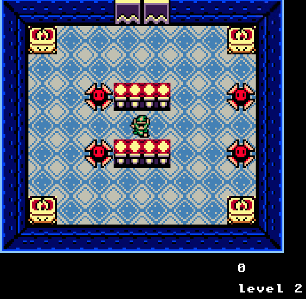
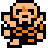

<div align="center">

# Zelda Kaboom!
> Zelda made with Kaboom.js!

<div>
  
</div>

 

## How to play:

```sh
    Avoid the enemies and find the exit!
```

## Controls

```sh
  Arrows - Move the player  
SpaceBar - Attack
```

## Enemies



   

</div>